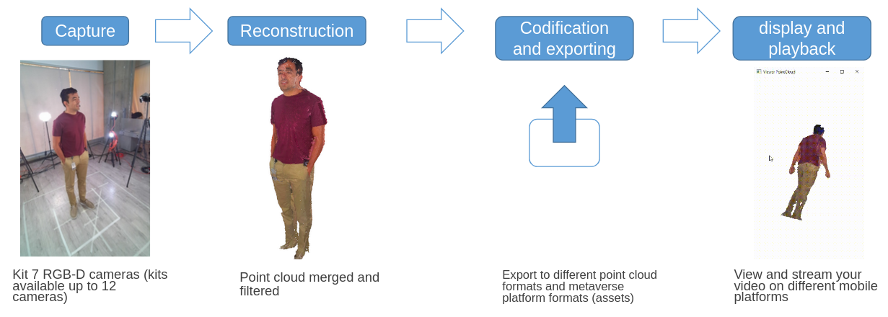
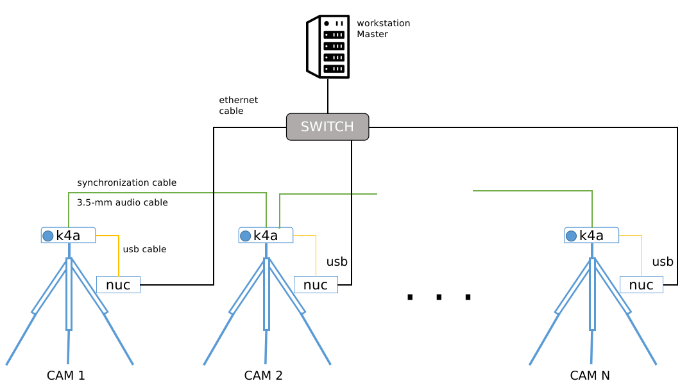
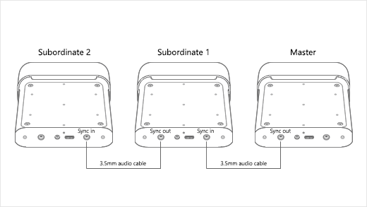
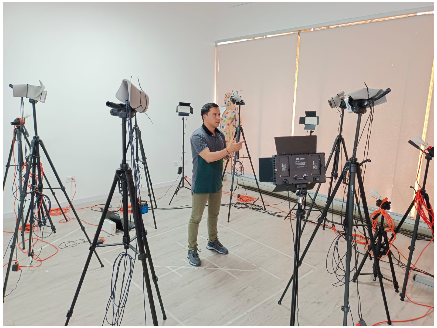

# TriDO

TriDO is a multi-camera capture system designed for 3D scene reconstruction and volumetric video generation. The system utilizes low-cost capture hardware and operates within a networked configuration. It includes a suite of tools that enable the following technical capabilities:

1. Multi-view video capture using Kinect 4 Azure devices (Module 1)
2. System calibration and adjustment (Module 2)
3. Point cloud preprocessing (Module 2)
4. Global 3D reconstruction (Module 3)
5. Visualization and export (Module 4)

## How Does It Work?

TriDO initiates the process by capturing synchronized video from an array of cameras simultaneously. It then filters individual point clouds and merges them into a unified point cloud. Once the merged cloud is obtained with a global reference, it is exported to various point cloud formats (PCD, PLY, etc.) for use in different metaverse environments.




### Module 1: Multi-view Capture

#### Capture Space and Hardware Setup

The following hardware is required to deploy the Volumetric Capture system:

- 1 workstation (desktop or laptop as the Master)
- N sensors (Kinect 4 Azure)
- N sensor processing units (Intel NUCs recommended as Slaves)
- N Standard Camera Complete Tripod Units with a minimum height of 1.6 meters
- 1 Network Switch with at least 1 Gbps bandwidth
- (N-1) LED Reflector Lamps

#### Connectivity Diagram

Each Slave unit (NUC) directly manages video capture for its connected sensor, executes recording commands, and uses its internal storage for data handling.





Below is an image of a volumetric capture setup using six Kinect 4 Azure sensors.



#### Configure Software
En cada uno de los equipos tanto Maestro y Esclavos debe ser instalado:
* [Python 3.10](https://www.python.org/downloads/release/python-3100/)
* [Azure-Kinect-Sensor-SDK](https://github.com/microsoft/Azure-Kinect-Sensor-SDK/tree/develop)

En una 

```bash
# Comando en bash para linux
python3  Capture_Multi.py
```
Este comando hara que el sistema inicie la captura simultanea de todos los sensores, se crearan N carpetas con los nombre K1, K2, ..., KN y dentro de ellas se crearan los folder color y depth que contienen las imagenes tando de color como de profundidad por cámara

```bash
Proyecto
├── Capture_Multi.py
├── k01                  #Folder camera k01           
│   ├── color            #Folder to color images 
│   │   ├── 00000.jpg   
│   │   ├── N-1.jpg    
│   │   └── N.jpg       
│   └── depth            #Folder to depth images
│       ├── 00000.jpg   
│       ├── N-1.jpg    
│       └── N.jpg        
├── k02                             
│   ├── color
│   │   ├── 00000.jpg   
│   │   ├── N-1.jpg    
│   │   └── N.jpg
│   └── depth
│       ├── 00000.jpg   
│       ├── N-1.jpg    
│       └── N.jpg
├── k03                             
│   ├── color
│   │   ├── 00000.jpg   
│   │   ├── N-1.jpg    
│   │   └── N.jpg
│   └── depth
│       ├── 00000.jpg   
│       ├── N-1.jpg    
│       └── N.jpg
├── k04                             
│   ├── color
│   │   ├── 00000.jpg   
│   │   ├── N-1.jpg    
│   │   └── N.jpg
│   └── depth
│       ├── 00000.jpg   
│       ├── N-1.jpg    
│       └── N.jpg
├── k05                             
│   ├── color
│   │   ├── 00000.jpg   
│   │   ├── N-1.jpg    
│   │   └── N.jpg
│   └── depth
│       ├── 00000.jpg   
│       ├── N-1.jpg    
│       └── N.jpg
└── k06                             
    ├── color
    │   ├── 00000.jpg   
    │   ├── N-1.jpg    
    │   └── N.jpg
    └── depth
        ├── 00000.jpg   
        ├── N-1.jpg    
        └── N.jpg
```
### Module 2: Calibration and Adjustment

### Module 3: Global 3D Reconstruction

### Module 4: Visualization and Export


