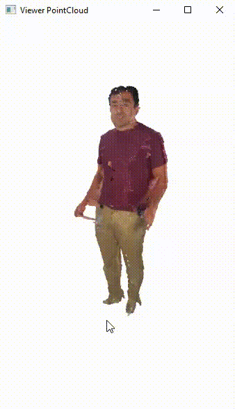

# TriDO

TriDO is a multi-camera capture system designed for 3D scene reconstruction and volumetric video generation. The system utilizes low-cost capture hardware and operates within a networked configuration. It includes a suite of tools that enable the following technical capabilities:

1. Multi-view video capture using Kinect 4 Azure devices (Module 1)
2. System calibration and adjustment (Module 2)
3. Point cloud preprocessing (Module 2)
4. Global 3D reconstruction (Module 3)
5. Visualization and export (Module 4)

## How Does It Work?

TriDO initiates the process by capturing synchronized video from an array of cameras simultaneously. It then filters individual point clouds and merges them into a unified point cloud. Once the merged cloud is obtained with a global reference, it is exported to various point cloud formats (PCD, PLY, etc.) for use in different metaverse environments.





### Module 1: Multi-view Capture

#### Capture Space and Hardware Setup

The following hardware is required to deploy the Volumetric Capture system:

- 1 workstation (desktop or laptop as the Master)
- N sensors (Kinect 4 Azure)
- N sensor processing units (Intel NUCs recommended as Slaves)
- N Standard Camera Complete Tripod Units with a minimum height of 1.6 meters
- 1 Network Switch with at least 1 Gbps bandwidth
- (N-1) LED Reflector Lamps

#### Connectivity Diagram

Each Slave unit (NUC) directly manages video capture for its connected sensor, executes recording commands, and uses its internal storage for data handling.


Below is an image of a volumetric capture setup using six Kinect 4 Azure sensors.


#### Configure Software
On each device, both Master and Slaves, install the following:

* [Python 3.10](https://www.python.org/downloads/release/python-3100/)
* [Azure-Kinect-Sensor-SDK](https://github.com/microsoft/Azure-Kinect-Sensor-SDK/tree/develop)

In a terminal, run the command:

```bash
# Comando en bash para linux
python3  Capture_Multi.py
```
This command will start simultaneous capture from all sensors. It will create N folders named K1, K2, ..., KN, each containing the folders color_images and depth_images, which store the color and depth images from each camera.

```bash
Project
├── Capture_Multi.py
├── k01                  #Folder camera k01           
│   ├── color            #Folder to color images 
│   │   ├── 00000.jpg   
│   │   ├── N-1.jpg    
│   │   └── N.jpg       
│   └── depth            #Folder to depth images
│       ├── 00000.jpg   
│       ├── N-1.jpg    
│       └── N.jpg        
├── k02                             
│   ├── color
│   │   ├── 00000.jpg   
│   │   ├── N-1.jpg    
│   │   └── N.jpg
│   └── depth
│       ├── 00000.jpg   
│       ├── N-1.jpg    
│       └── N.jpg
├── k03                             
│   ├── color
│   │   ├── 00000.jpg   
│   │   ├── N-1.jpg    
│   │   └── N.jpg
│   └── depth
│       ├── 00000.jpg   
│       ├── N-1.jpg    
│       └── N.jpg
├── k04                             
│   ├── color
│   │   ├── 00000.jpg   
│   │   ├── N-1.jpg    
│   │   └── N.jpg
│   └── depth
│       ├── 00000.jpg   
│       ├── N-1.jpg    
│       └── N.jpg
├── k05                             
│   ├── color
│   │   ├── 00000.jpg   
│   │   ├── N-1.jpg    
│   │   └── N.jpg
│   └── depth
│       ├── 00000.jpg   
│       ├── N-1.jpg    
│       └── N.jpg
└── k06                             
    ├── color
    │   ├── 00000.jpg   
    │   ├── N-1.jpg    
    │   └── N.jpg
    └── depth
        ├── 00000.jpg   
        ├── N-1.jpg    
        └── N.jpg
```
### Module 2: Calibration and Adjustment

The calibration process involves finding the coordinates or transformation between cameras. Before starting any event capture, follow these steps:

    A person should enter the area covered by the cameras, extending their arms and legs in a star shape while wearing a hat and clothing in a color that contrasts with black and includes selectable markers.
    Slowly rotate with arms and legs extended in front of each camera, spending 2 to 3 seconds facing each one.

See calibration process video:

[](https://www.youtube.com/watch?v=UlgHN4ABupE)


### Module 3: Global 3D Reconstruction

As a result of the calibration process, N transformation matrices are obtained, each relating the position of one camera to another. These matrices form a chain of relationships that enable a global reconstruction, taking Camera 1 (Master) as the reference point.

To start, run the following command in a terminal:


```bash
# Comando en bash para linux
python3  Generate_volumetric_Video.py
```

This command will generate a unified point cloud for each frame, which can be visualized with any point cloud viewing software, such as CloudCompare.

To view the video in .ply point cloud format generated from this process, execute the following command in a terminal. This will sequentially display each point cloud frame:

```bash
# Comando en bash para linux
python3  06_Playback.py
```


### Module 4: Visualization and Export

From the previous module, N point clouds are obtained for each captured frame. To use these point clouds in a game engine like Unity, they must be transformed into assets compatible with that engine.

For the TriDO project, the default game engine is Unity, and this module is designed specifically to export assets for use in Unity.


INFORMATION

suarez@lidarit.com
